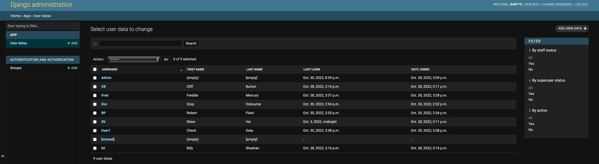
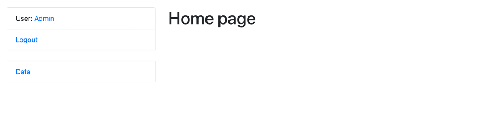
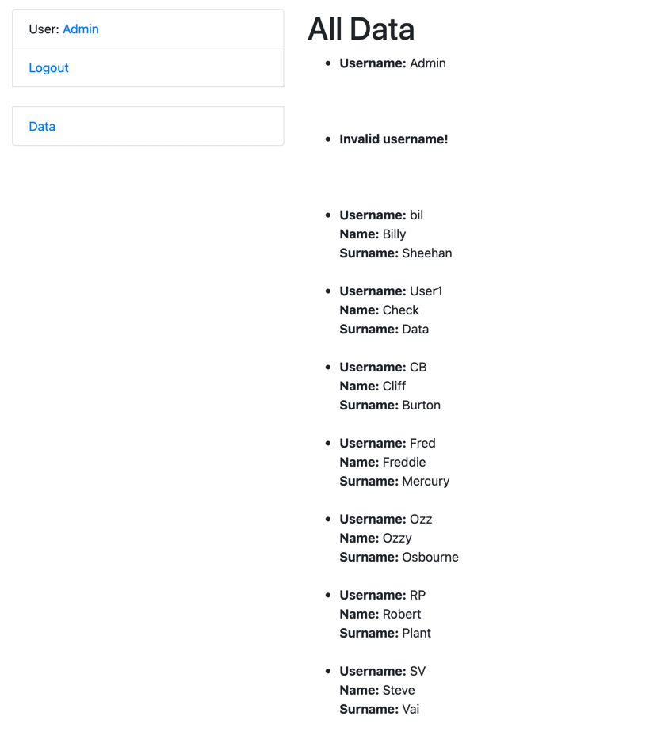
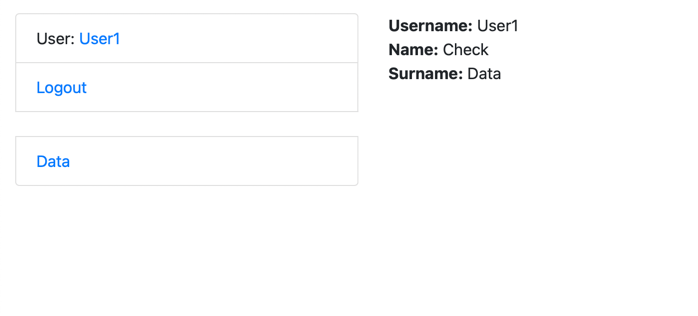
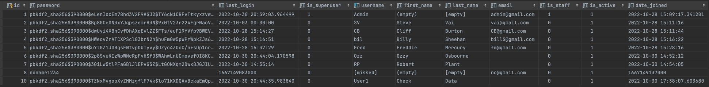

# User-Data project

Django project to view user data with admin user

## Installation

Python3 must be already installed 

```shell
git clone https://github.com/Evgeniy994/User-Data.git
python3 -m venv venv
source venv/bin/activated
pip install -r requirements.txt
python manage.py runserver
```

## Features

All user data for admin user


## Demo




